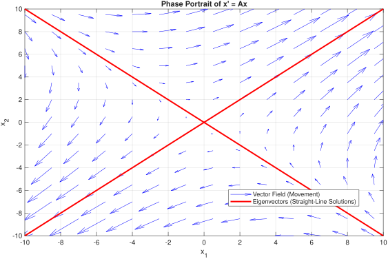
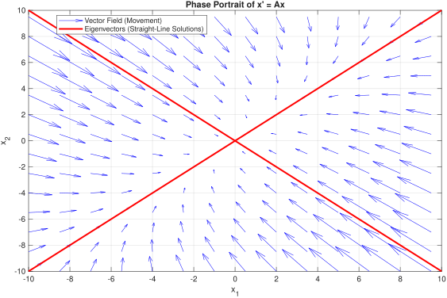
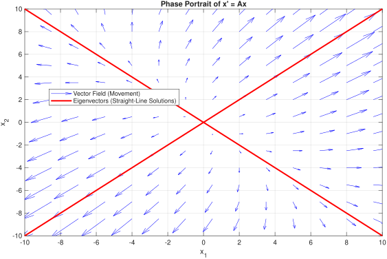
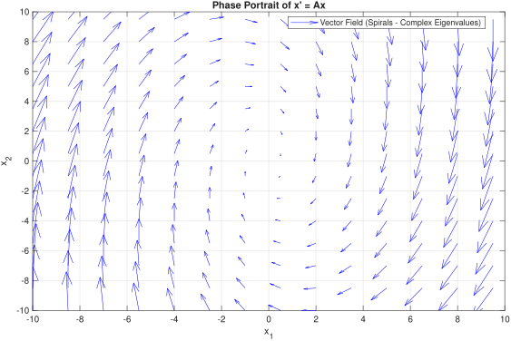

# MATLAB for Linear Algebra (V2)

## What's New in V2
This toolkit has been upgraded for the AY25/26 semester to prioritize mathematical accuracy and ease of use for NUS Engineering students.
* **Symbolic Math Integration:** Methods now natively support and return `sym` objects, providing exact fractional results (e.g., `1/3`) instead of messy floating-point decimals.
* **Step-by-Step Outputs:** Functions like `gramSchmidt` now provide the exact algebraic working, intermediate projections, and inner products for exam verification.
* **Subspace Extraction:** Added a new utility to automatically find a linearly independent basis for the span of any given set of vectors.
* **Chapter 7 Visualizer:** Added a Phase Portrait plotter to easily identify Sinks, Sources, Saddles, and Spirals geometrically.
* **Rigorous QR Decomposition:** Upgraded `gramSchmidt` to the Modified Gram-Schmidt algorithm, ensuring the $R$ matrix is strictly upper-triangular and $V = QR$ reconstruction is successful.
* **Parametric LSS Solver:** The Least Squares solver now identifies infinite solution spaces and formats them as $\mathbf{x} = \mathbf{x}_p + s_1 \mathbf{v}_1 + \dots$

## Setup 
*Note: This toolkit requires the **Symbolic Math Toolbox** to be installed in your MATLAB Add-Ons.*

```sh
git clone https://github.com/hongmengsim/nus-ma1508e-v2.git
cd nus-ma1508e-v2
```
Usage
Initialise the class instance in your Command Window:
```MATLAB
m = MA1508E();
```
To ensure exact fractional outputs, it is highly recommended to pass your matrices as symbolic objects using the `sym()` function:
```MATLAB
A = sym([1 0 -2; 1 1 1; 1 -1 1]);
m.getPD(A);
```
**Example Verification**

$$
S = \begin{Bmatrix} 
\begin{pmatrix} 1 \cr 1 \cr 1 \end{pmatrix}, 
\begin{pmatrix} 0 \cr 1 \cr -1 \end{pmatrix}, 
\begin{pmatrix} -2 \cr 1 \cr 1 \end{pmatrix} 
\end{Bmatrix}
$$

To check if the set of vectors S is orthogonal:
```MATLAB
A = sym([1 0 -2; 1 1 1; 1 -1 1]);
m.isOrthogonalSet(A);
```
Output:
```MATLAB
  The set is orthogonal
```
---
## 📚 Detailed API Reference
Click on any method below to expand its full documentation, parameters, and conditions.

## ✅ How to Verify Your Results
The V2.1 engine is designed for easy verification. Run these checks in your Command Window:

1. **Check Orthonormality:** `simplify(e' * e)` should yield the **Identity Matrix**.
2. **Check QR Reconstruction:** `simplify(e * r)` should yield your original matrix **V**.
3. **Check LSS Accuracy:** `simplify(transpose(A) * (b - A*x_p))` should yield a **Zero Vector**.

### Chapter 1: Linear Systems
<details>
<summary><code>isValidERO(str)</code></summary>

- **`str`**: String containing the elementary row operation.
- **Description**: Validates the syntax of an ERO string.
- **V2.1 Upgrades**: 
  - **Space-Insensitive**: The parser now accepts both standard (`R2 + 2R1`) and compact (`R2+2R1`) formats for faster input during timed labs.
  - **Rules**: Row prefixes must remain an uppercase **R**. Supports exact fractions (e.g., `1/2R1`).
</details>

<details>
<summary><mark><code>generateElemAdd(data)</code> / <code>generateElemSwap(data)</code></mark></summary>

- **`data`**: Struct containing the elementary row operation.
- **Description**: Returns the elementary matrix corresponding to the elementary row operation.
  
  <details>
  <summary><code>More Information</code></summary>
    
  ## ⚙️ Internal Elementary Matrix Methods

  While `generateElemMatrix` is the primary entry point for string commands, the following methods serve as the underlying "engine" for matrix     construction. These methods directly manipulate the identity matrix to create the required transformation.
    
  ### 1. `generateElemAdd(obj, data)`
  
  This method handles the **Row Addition/Subtraction** operation. Mathematically, this corresponds to the operation:
  
  $$R_{\text{target}}\leftarrow R_{\text{target}}+k\cdot R_{\text{source}}$$
  
  #### Logic
  The method creates an $n \times n$ identity matrix $I$ and modifies the entry at the intersection of the target row and the source row. If $A$ is the input matrix, the elementary matrix $E$ is constructed such that $E \times A$ performs the addition.
  
  In the identity matrix $I$:
  
  $$E_{i,j}=k\quad\text{where }i=\text{target row}, j=\text{source row}$$
  
  #### Internal Data Structure
  The `data` struct must contain:
  * `data.size`: The dimension $n$ of the square matrix.
  * `data.left(2)`: The index of the row being modified ($i$).
  * `data.right(1)`: The scalar multiplier ($k$).
  * `data.right(2)`: The index of the source row ($j$).
  
  </details>
</details>

<details>
<summary><code>generateElemMatrix(str, n)</code></summary>

- **`str`**: Elementary row operation to be performed (e.g., `R2+0.5R3`, `3R1`, `R4-1R2`, `R2SR3`).
- **`n`**: The number of rows of the target matrix.
- **Description**: Generates the corresponding elementary matrix used to perform the row operation via pre-multiplication.
- **V2.1 Upgrades**: Fully supports space-insensitive strings and seamlessly parses symbolic fractions into exact matrix elements.
</details>

<details>
<summary><mark><code>performERO(A)</code></mark></summary>
  
### `performERO(A)`
**Description:** Launches an interactive, step-by-step console loop that allows the user to apply Elementary Row Operations (EROs) to a given matrix. The matrix is updated and printed to the console after every successful operation. Type `exit` or `quit` to break the loop.

> **Note for V2:**
  - Input strings no longer require quotation marks in the console. Furthermore, passing a symbolic matrix (`sym()`) ensures all intermediate fractions remain exact.
  - Now utilizes the space-insensitive parser for rapid data entry. 
  - **Tip:** Pass your matrix as `A = sym(A)` before running this method to ensure all intermediate row additions and scalar multiplications remain in exact fractional form instead of decimals.

#### **Parameters**
- **`A`** *(Matrix | sym)*: The target matrix you want to perform operations on. 

#### **Supported Operation Syntax**
The console input parser requires specific formatting. Use the letter `R` followed by the row number.

| Operation Type | Syntax | Description | Example |
| :--- | :--- | :--- | :--- |
| **Row Swapping** | `Ri S Rj` | Swaps Row *i* with Row *j* | `R1 S R2` |
| **Scalar Multiplication** | `cRi` | Multiplies Row *i* by a scalar value *c* | `3R1` or `1/2R3` |
| **Row Addition** | `Rj + cRi` | Adds *c* times Row *i* to Row *j* | `R2 + 2R1` |
| **Row Subtraction** | `Rj - cRi` | Subtracts *c* times Row *i* from Row *j* | `R4 - R2` |

#### **Example Usage Session**

**1. Initialize in Command Window:**
```matlab
>> m = MA1508E();
>> A = sym([1 2 3; 2 4 8]);
>> m.performERO(A);
```
</details>

### Chapter 2: Matrices
<details>
<summary><code>leftInverse(A)</code></summary>

- **`A`**: $m \times n$ matrix to check.
- **Description**: Returns the left inverse of $A$ if it exists. 
- **Condition**: $m > n$ for left inverse to exist.
</details>

<details>
<summary><code>rightInverse(A)</code></summary>

- **`A`**: $m \times n$ matrix to check.
- **Description**: Returns the right inverse of $A$ if it exists. 
- **Condition**: $m < n$ for right inverse to exist.
</details>

### Chapter 3: Vector Spaces & Change of Basis

<details>
<summary><code>isBasis(V)</code></summary>

### Evaluates if a given set of column vectors forms a valid basis for $\mathbb{R}^n$.

#### Parameters
* **`V`**: A matrix where each column represents a vector in the set.

#### 🛠 Usage Example
```matlab
% Check if these two vectors form a basis in R^2
B = [1, 2; 
     0, 1];
tk.isBasis(B);
% Output: [v] Check Passed: Set is a valid basis.
```
</details>

<details>
<summary><code>getTransitionMatrix(B, C)</code></summary>

### Calculates the transition matrix $P_{C \leftarrow B}$ (also written as $[I]_{C,B}$) which translates coordinates from Basis $B$ to Basis $C$.

#### Parameters
* **`B`**: The starting basis matrix (columns are basis vectors).
* **`C`**: The target basis matrix (columns are basis vectors).

> [!TIP]
> **The Orthogonal Shortcut:** If you know both matrices are orthogonal (e.g., standard bases or rotation matrices), you do not need to calculate an inverse manually in an exam. The transition matrix is simply $C^T B$. You can use this function to verify that shortcut!

#### 🛠 Usage Example
```matlab
E = [1, 0; 0, 1]; % Standard Basis
B = [2, 1; -1, 3]; % Custom Basis

% Find the transition matrix from Standard (E) to Custom (B)
P = tk.getTransitionMatrix(E, B);
```
</details>

<details>
<summary><code>changeVectorBasis(v_B, B, C)</code></summary>

### Converts the coordinates of a specific physical vector from one basis to another using the relation $[v]_C = P_{C \leftarrow B} [v]_B$.

#### Parameters
* **`v_B`**: The coordinate vector relative to Basis $B$.
* **`B`**: The starting basis matrix.
* **`C`**: The target basis matrix.

#### 🛠 Usage Example
```matlab
E = [1, 0; 0, 1];
B = [2, 1; -1, 3];
v_E = [5; 5]; % Vector in standard coordinates

% Translate v_E into coordinates for Basis B
v_B = tk.changeVectorBasis(v_E, E, B);
% Output: [10/7; 15/7]
```
</details>

<details>
<summary><code>similarityTransform(A_B, B, C)</code></summary>

### Converts a linear transformation matrix $A$ defined in Basis $B$ into its equivalent representation in Basis $C$. This uses the relation $[T]_C = P^{-1} [T]_B P$.

> [!NOTE]
> **Pre-cursor to Chapter 6:** If $A$ is a standard transformation matrix, and $C$ is a matrix of its eigenvectors, this function will return a purely diagonal matrix of its eigenvalues. This is the exact mechanism behind **Diagonalization**.

#### Parameters
* **`A_B`**: The square linear transformation matrix in Basis $B$.
* **`B`**: The starting basis matrix (columns are basis vectors).
* **`C`**: The target basis matrix (columns are basis vectors).

#### 🛠 Usage Example
```matlab
A_Standard = [4, 1; 3, 2];
E = [1, 0; 0, 1];
B_Eigen = [1, -1; 1, 3]; % Eigenvector basis

% Perform the similarity transform
A_Diag = tk.similarityTransform(A_Standard, E, B_Eigen);

% The output A_Diag will be a diagonal matrix of the eigenvalues:
% [5, 0]
% [0, 1]
```
</details>

### Chapter 5: Orthogonal Projection
<details>
<summary><code>isOrthogonalSet(S)</code> / <code>isOrthonormalSet(S)</code></summary>

- **`S`**: Set of vectors in matrix form.
- **Description**: Prints whether the given set of vectors is strictly orthogonal or orthonormal.
</details>

<details>
<summary><code>isOrthogonalTo(S, target)</code></summary>

- **`S`**: Set of vectors in matrix form.
- **`target`**: The vector to be checked.
- **Description**: Prints whether `target` is orthogonal to the subspace spanned by the set `S`.
</details>

<details>
<summary><code>toOrthonormalSet(OG)</code></summary>

- **`OG`**: Orthogonal set of vectors in matrix form.
- **Description**: Normalises the set of vectors. Returns `ON`, the corresponding orthonormal set.
</details>

<details>
<summary><code>dotWithSet(S, v)</code></summary>

- **`S`**: Set of vectors in matrix form.
- **`v`**: Column vector with the same number of rows as `S`.
- **Description**: Returns the dot product between each column of `S` and `v`.
</details>

<details>
<summary><code>orthogonalProj(S, w)</code></summary>

- **`S`**: Set of vectors in matrix form.
- **`w`**: The vector to be projected.
- **Description**: Returns the exact orthogonal projection of `w` onto the span of `S`.
</details>

<details>
<summary><mark><code>gramSchmidt(v, showSteps)</code></mark></summary>

- **`v`**: The basis to be converted into an orthonormal basis.
- **`showSteps`**: Boolean (Default = `true`). Set to false to hide algebraic working.
- **Description**: Performs **Modified Gram-Schmidt** orthonormalization.
- **V2.1 Upgrades**:
  - **Surd Support**: Returns exact symbolic square roots (e.g., $\frac{\sqrt{6}}{3}$) instead of decimal approximations.
  - **QR Decomposition**: Returns `[e, r]` where `e` is the orthonormal $Q$ matrix and `r` is the upper-triangular $R$ matrix. Guaranteed to satisfy $V = QR$ and $Q^T Q = I$.

    <details>
    <summary><code>More Information & Usage Example</code></summary>
      
    ## 📐 Orthogonal Projection Methods

    ### `gramSchmidt(obj, v, showSteps)`
    
    This method performs the exact **Gram-Schmidt Orthonormalization** process on a set of column vectors. Because it leverages MATLAB's symbolic math engine (`sym`), it retains exact surd (square root) and fractional forms rather than converting to floating-point decimals.
    
    #### Mathematical Logic
    
    Given a set of linearly independent input vectors v₁, v₂, ..., vₙ, the algorithm sequentially constructs an orthogonal set u₁, u₂, ..., uₙ by subtracting the projections of the current vector onto the previously computed orthonormal vectors:

    uₖ = vₖ - Σ ⟨vₖ, eᵢ⟩ eᵢ
    
    It then normalizes the resulting vector to build the orthonormal basis e₁, e₂, ..., eₙ:
    
    eₖ = uₖ / ||uₖ||
    
    #### Parameters
    * `v`: A matrix where each column represents an input vector $v_k$.
    * `showSteps` *(optional, logical)*: Defaults to `true`. If enabled, the console will print a detailed, step-by-step breakdown of the projection coefficients, intermediate orthogonal vectors, and magnitude calculations.
    
    #### Returns
    * `e`: A matrix containing the resulting orthonormal basis vectors. (This is mathematically equivalent to the $Q$ matrix in a $QR$ decomposition).
    * `r`: An upper triangular matrix containing the projection coefficients and vector magnitudes. (This is equivalent to the $R$ matrix).
    
    ---
    
    ### 🛠 Usage Example
    
    ```matlab
    % Instantiate the toolkit
    tk = MA1508E();
    
    % Define a set of input column vectors as a matrix
    % For example: v1 = [1; 1; 0] and v2 = [1; -1; 1]
    V = [1,  1; 
         1, -1; 
         0,  1];
    
    % Run the Gram-Schmidt process (with step-by-step output enabled)
    [Q, R] = tk.gramSchmidt(V, true);
    
    % Q contains the exact symbolic orthonormal basis
    % R contains the upper triangular coefficients
    fprintf('\n--- Final Outputs ---\n');
    disp("Orthonormal Basis (Q):");
    disp(Q);
    
    disp("Upper Triangular Matrix (R):");
    disp(R);
    ```
    </details>
</details>

<details>
<summary><mark><code>calcLSS(A, b)</code></mark></summary>

- **`A`**: The matrix to calculate the least squares solution.
- **`b`**: The column vector.
- **Description**: Solves the Normal Equations $(A^T A)\mathbf{x} = A^T \mathbf{b}$ symbolically.
- **V2.1 Upgrades**:
  - **Parametric Vector Form**: If the system is underdetermined (infinite solutions), the output automatically identifies the null space and formats the general solution as a geometric translation: $\mathbf{x} = \mathbf{x}_p + s_1 \mathbf{v}_1 + \dots$
  - Returns `[x_gen, basis, x_p]` for immediate workspace use.

    <details>
    <summary><code>More Information & Example Usage</code></summary>

    ## 📈 Least Squares Analysis

    ### `calcLSS(obj, A, b)`
    
    This method computes the **Least Squares Solution** for an overdetermined or inconsistent system of linear equations $Ax = b$. It intelligently handles both systems with a unique least squares solution and systems with infinite least squares solutions (returning the exact parameterized form).
    
    #### Mathematical Logic
    When $Ax = b$ has no exact solution, this method finds the vector $\hat{x}$ that minimizes the error $\|Ax - b\|$ by solving the **Normal Equations**:
    
    $$(A^T A)\hat{x} = A^T b$$
    
    The function calculates this by generating an augmented matrix $[A^T A \mid A^T b]$ and reducing it to Reduced Row Echelon Form (RREF). 
    * If $A$ has linearly independent columns, it returns the unique particular solution $x_p$.
    * If $A$ has linearly dependent columns, it computes the null space basis and returns the solution in parametric form: $x = x_p + s_1v_1 + \dots + s_kv_k$.
    
    #### Parameters
    * `A`: The $m \times n$ coefficient matrix.
    * `b`: The $m \times 1$ column vector representing the right-hand side of the system.
    
    #### Returns
    * `x_gen`: The symbolic general solution (useful for passing into other MATLAB symbolic functions).
    * `basis`: A matrix where each column is a basis vector $v_i$ for the null space of $A^T A$.
    * `x_p`: The particular least squares solution vector.
    
    ---
    
    ### 🛠 Usage Example
    
    ```matlab
    % Instantiate the toolkit
    tk = MA1508E();
    
    % Define an overdetermined system (more equations than unknowns)
    A = [1,  1; 
         1, -1; 
         1,  1];
         
    b = [2; 
         1; 
         3];
    
    % Calculate the Least Squares Solution
    [x_gen, basis, x_p] = tk.calcLSS(A, b);
    
    % The function will automatically print a formatted report to the console:
    %
    % ==================================================
    %                LEAST SQUARES ANALYSIS               
    % ==================================================
    % System: (A^T * A)x = A^T * b
    %
    % RESULT: Unique Solution Found
    % --------------------------------------------------
    % x_lss =
    % [ 5/2]
    % [ 1/2]
    % ==================================================
    ```
    </details>
</details>

### Chapter 6: Diagonalisation
<details>
<summary><code>getEigenvalues(A)</code></summary>

- **`A`**: The matrix corresponding to the differential system.
- **Description**: Returns both real and complex eigenvalues corresponding to `A`.
</details>

<details>
<summary><mark><code>getEigenvector(A, lambda, output)</code></mark></summary>

- **`A`**: The matrix corresponding to the differential system.
- **`lambda`**: An eigenvalue of `A`.
- **`output`**: Boolean (Default = `true`). Show steps to obtain the eigenvector.
- **Description**: Returns the basis for the eigenspace associated to `lambda`.
- **V2.1 Upgrades**: 
  - **Symbolic Null Space Analysis**: By leveraging the symbolic engine, this method now reliably extracts exact basis vectors even for complex eigenvalues ($\lambda = a \pm bi$) without falling victim to floating-point truncation errors common in standard numerical solvers.
 
    <details>
    <summary><code>More Information & Example Usage</code></summary>

    ## 📐 Diagonalisation & Eigenspaces

    ### `getEigenvector(obj, A, lambda, output)`
    
    This method calculates the exact basis for the eigenspace associated with a specific eigenvalue $\lambda$. It leverages MATLAB's symbolic engine to construct the characteristic matrix, reduce it, and extract the exact parametric solution without floating-point rounding errors.
    
    #### Mathematical Logic
    By definition, an eigenvector $v$ associated with an eigenvalue $\lambda$ satisfies the equation $Av = \lambda v$. This method reorganizes the equation to solve for the null space of the characteristic matrix:
    
    $$(\lambda I - A)v = 0$$
    
    The method computes the matrix $(\lambda I - A)$, finds its Reduced Row Echelon Form (RREF), and extracts the linearly independent basis vectors (the geometric multiplicity) that span the eigenspace.
    
    #### Parameters
    * `A`: The $n \times n$ square matrix.
    * `lambda`: The scalar eigenvalue you wish to analyze. *(Note: The method will automatically verify if this is a valid eigenvalue before proceeding).*
    * `output` *(optional, logical)*: Defaults to `true`. If `true`, the function automatically prints a detailed eigenspace report to the console. Set to `false` if you only want the return variables for use in a larger script.
    
    #### Returns
    * `V`: A matrix where each column is a linearly independent eigenvector forming the basis of the eigenspace.
    * `genSol`: The generalized, parameterized symbolic solution (e.g., $x = s_1v_1 + s_2v_2$).
    
    ---
    
    ### 🛠 Usage Example
    
    ```matlab
    % Instantiate the toolkit
    tk = MA1508E();
    
    % Define a 2x2 square matrix
    A = [4, 1; 
         3, 2];
    
    % Calculate the eigenvector for the known eigenvalue lambda = 5
    [V, genSol] = tk.getEigenvector(A, 5);
    
    % The function will automatically print a formatted report to the console:
    %
    % --- Eigenspace Analysis for lambda = 5 ---
    % Characteristic Matrix (lambda*I - A) reduced to RREF:
    % [ 1, -1]
    % [ 0,  0]
    %
    % Basis for the Eigenspace:
    % [ 1]
    % [ 1]
    %
    % Parameterized General Solution (x = s1*v1 + ...):
    % [ s1]
    % [ s1]
    ```
  
    </details>
</details>

<details>
<summary><code>isAssociatedEigenvalue(A, lambda)</code></summary>

- **`A`**: The matrix corresponding to the differential system.
- **`lambda`**: Eigenvalue to verify.
- **Description**: Returns `true` if lambda is an eigenvalue associated to `A`, `false` otherwise.
</details>

<details>
<summary><mark><code>getGeneralisedEigenvector(A, lambda)</code></mark></summary>

- **`A`**: The matrix corresponding to the differential system.
- **`lambda`**: An eigenvalue of `A`.
- **Description**: Returns the matrix which gives you the valid generalised eigenvector for defective matrices.

  <details>
  <summary><code>More Information & Usage Example</code></summary>
  
  ### `getGeneralisedEigenvector(obj, A, lambda)`
  
  This method calculates a **Generalized Eigenvector** (of rank 2) for a defective matrix. This is used when an eigenvalue's algebraic multiplicity is greater than its geometric multiplicity (i.e., there are not enough standard eigenvectors to form a basis for diagonalization).
  
  #### Mathematical Logic
  When a standard eigenvector $v_1$ has already been found for an eigenvalue $\lambda$, a generalized eigenvector $v_2$ is a vector that satisfies the following equation:
  
  (A−λI)v2​=v1​
  
  The method constructs an augmented matrix by appending $v_1$ to the characteristic matrix: $[ (A - \lambda I) \mid v_1 ]$. It reduces this system to Reduced Row Echelon Form (RREF) and safely extracts a valid generalized eigenvector by automatically setting any free variables to $0$.
  
  #### Parameters
  * `A`: The $n \times n$ square, defective matrix.
  * `lambda`: The scalar eigenvalue associated with the missing eigenvectors.
  
  #### Returns
  * `v2`: A symbolic column vector representing a valid generalized eigenvector.
  
  ---
  
  ### 🛠 Usage Example
  
  ```matlab
  % Instantiate the toolkit
  tk = MA1508E();
  
  % Define a defective 2x2 matrix 
  % (Eigenvalue lambda = 3 has algebraic mult. 2, but geometric mult. 1)
  A = [ 4, 1; 
       -1, 2];
  
  % Calculate the generalized eigenvector for lambda = 3
  v2 = tk.getGeneralisedEigenvector(A, 3);
  
  % The function will automatically print a formatted report:
  %
  % --- Eigenspace Analysis for lambda = 3 ---
  % Characteristic Matrix (lambda*I - A) reduced to RREF:
  % [ 1, 1]
  % [ 0, 0]
  % Basis for the Eigenspace:
  % [ -1]
  % [  1]
  % Parameterized General Solution (x = s1*v1 + ...):
  % [ -s1]
  % [  s1]
  %
  % The augmented matrix [M | v1] is reduced to:
  % [ 1, 1, -1]
  % [ 0, 0,  0]
  %
  % By setting free variables to 0, a valid generalised eigenvector is:
  % [ -1]
  % [  0]
  ```

  </details>
</details>

### Chapter 7: System of Linear Differential Equations
<details>
<summary><mark><code>generateInitialConditions(n)</code></mark></summary>

### An interactive utility function that prompts the user in the Command Window to input specific starting values for an Initial Value Problem (IVP). *Note: This is typically called automatically by `solveDifferentialSystem`.*
</details>

<details>
<summary><mark><code>solveDifferentialSystem(A, isInitial)</code></mark><summary>

### The core ODE solver. This method doesn't just output the final answer; it walks through the characteristic analysis (eigenvalues) before constructing the general or specific solution. 

It is mathematically robust and automatically handles:
* Standard distinct real roots.
* Complex eigenvalues (automatically simplifying into $\sin$ and $\cos$ terms).
* **Defective Matrices** (repeated roots that require generalized eigenvectors, outputting the correct $t \cdot e^{\lambda t}$ terms).
* Decoupled systems and zero-eigenvalue states.

#### Parameters
* **`A`**: The $n \times n$ coefficient matrix representing the system $y' = Ay$.
* **`isInitial`** *(optional, logical)*: 
    * `false` (**Default**): Returns the General Solution with unknown constants ($C_1, C_2, \dots$).
    * `true`: Triggers an interactive prompt for $y(0)$ values and solves the Initial Value Problem (IVP).

> [!TIP]
> **Exam Verification:** Use the `false` flag to check your manual eigenvalues and characteristic equations. If your manual $\lambda$ values don't match the "Characteristic Analysis" section of the output, you likely made a sign error in your determinant!

#### 🛠 Usage Example 1: General Solution
```matlab
% A system with complex eigenvalues (+/- i)
A_Rotation = [0, -1; 
              1,  0];

% Call without the second argument
tk.solveDifferentialSystem(A_Rotation);

% Output will display Eigenvalues (i, -i) 
% and the general trigonometric solution.
</details>

<details>
<summary><mark><code>plotPhasePortrait(A)</code></mark></summary>
  
Use the `m.plotPhasePortrait(A)` function to instantly visualize the stability of 2x2 differential systems. The thick red lines indicate the exact straight-line solutions (eigenvectors).

### 1. The Saddle Point (Unstable)

One positive eigenvalue, one negative eigenvalue. The arrows flow inward along one eigenvector and outward along the other.
```MATLAB
A = sym([1 2; 2 1]);
m.plotPhasePortrait(A);
```


### 2. The Sink / Stable Node

Both eigenvalues are negative. All trajectories are pulled directly into the origin over time.
```MATLAB
A = sym([-2 1; 1 -2]);
m.plotPhasePortrait(A);
```


### 3. The Source / Unstable Node

Both eigenvalues are positive. All trajectories are pushed outward and away from the origin.
```MATLAB
A = sym([2 1; 1 2]);
m.plotPhasePortrait(A);
```


### 4. The Spiral

Complex eigenvalues ($\lambda = a \pm bi$). If the real part a is negative, it spirals inward (Stable). If a is positive, it spirals outward (Unstable).
```MATLAB
A = sym([-1 1; -5 -1]);
m.plotPhasePortrait(A);
```

</details>

